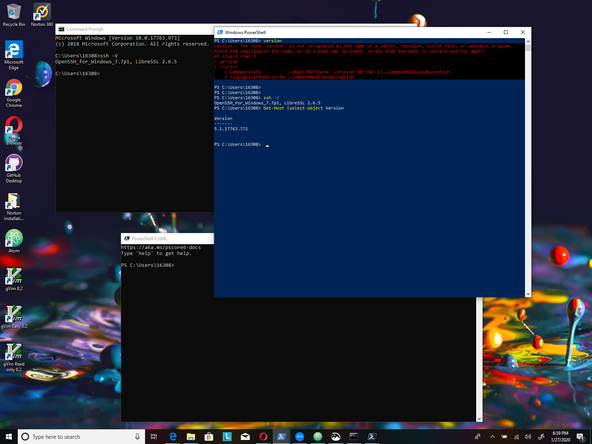
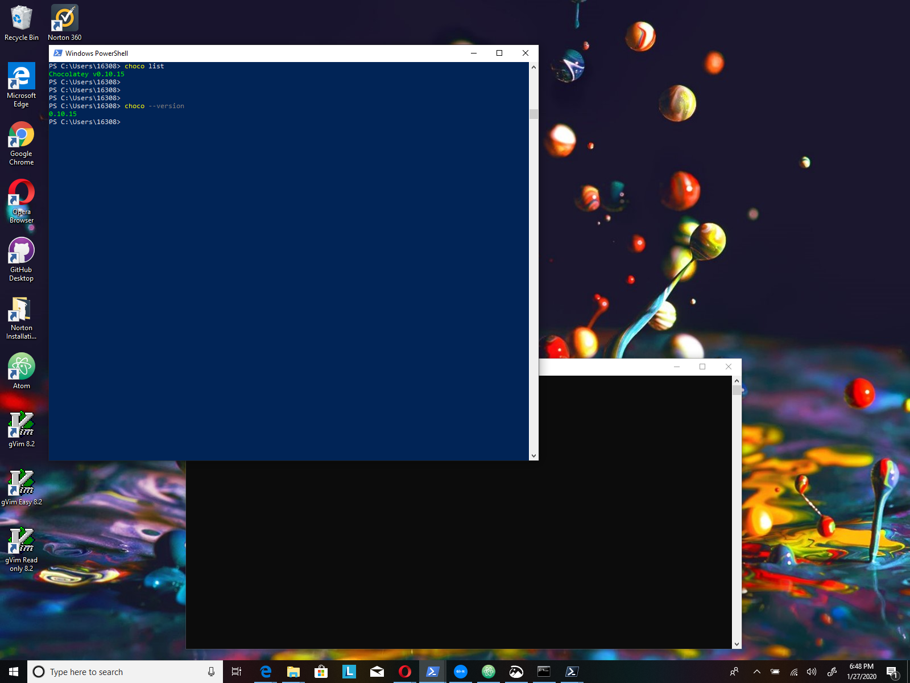
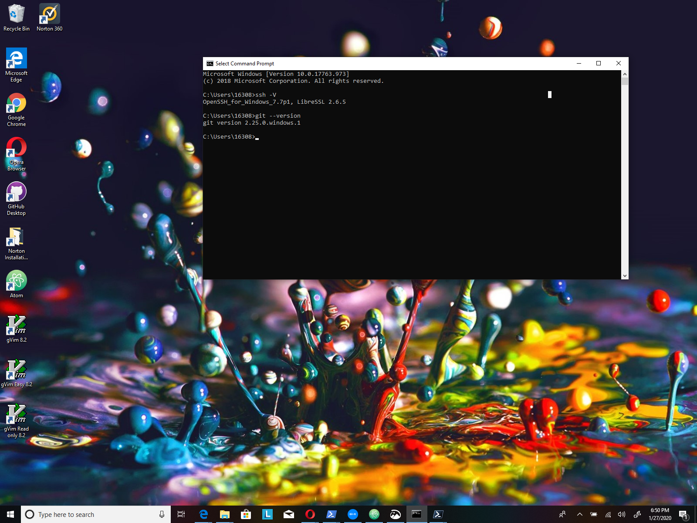
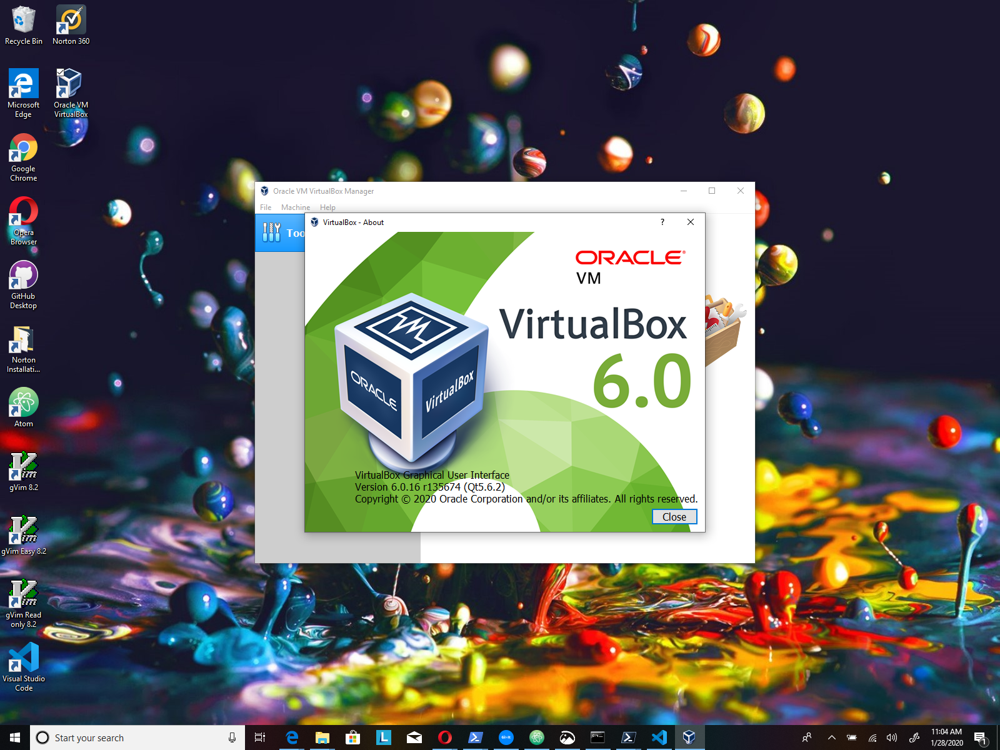
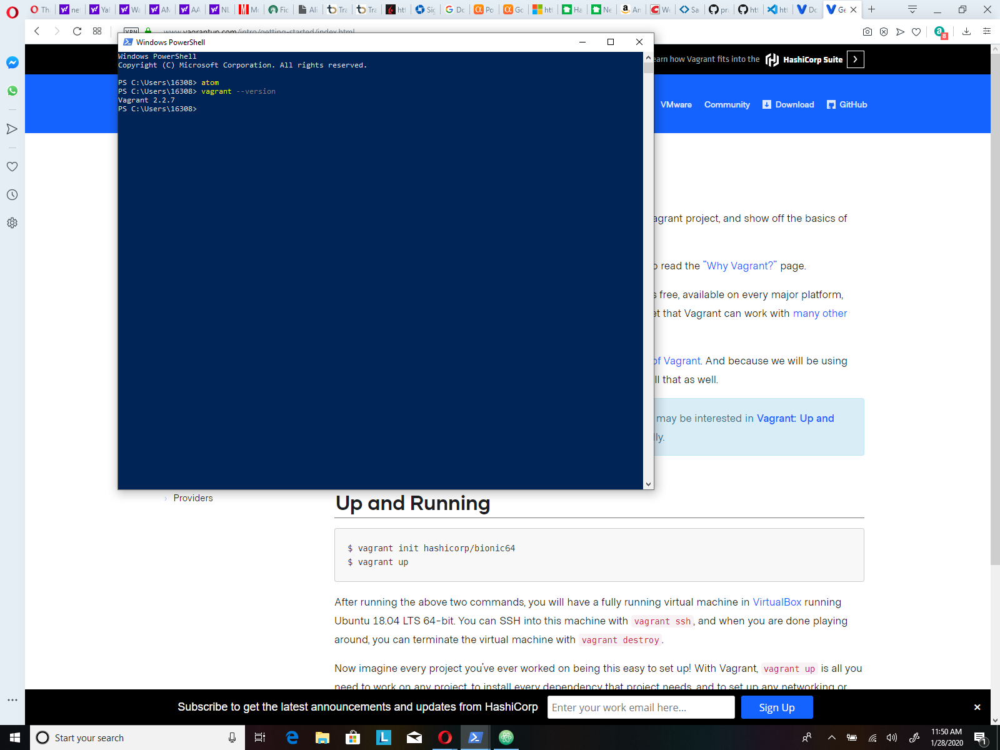
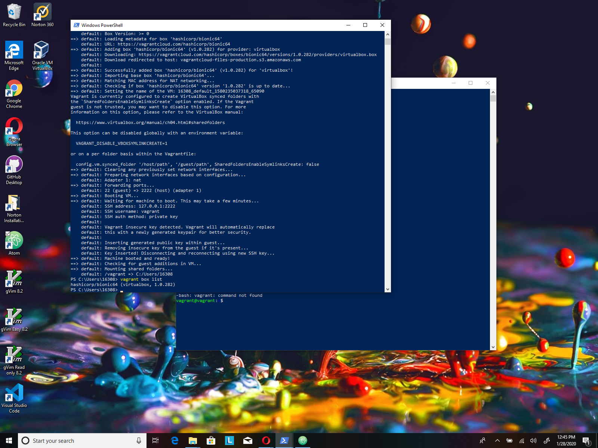
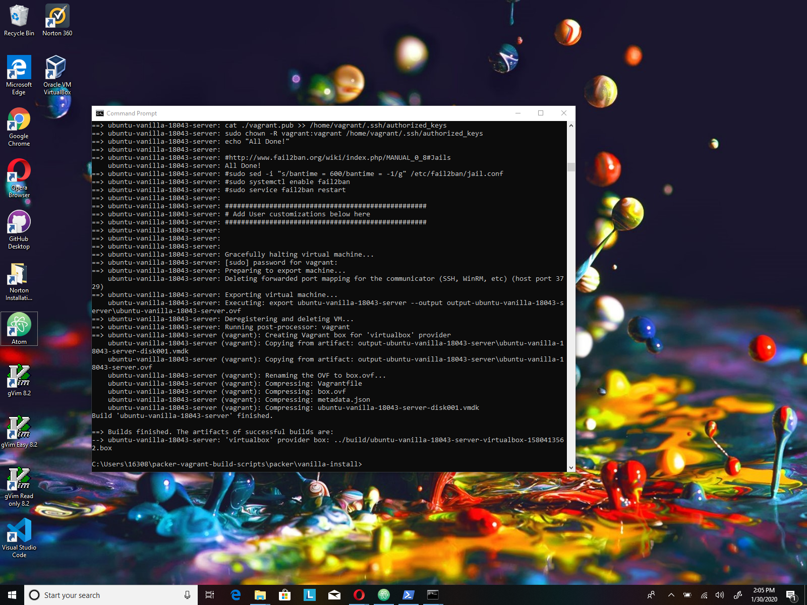
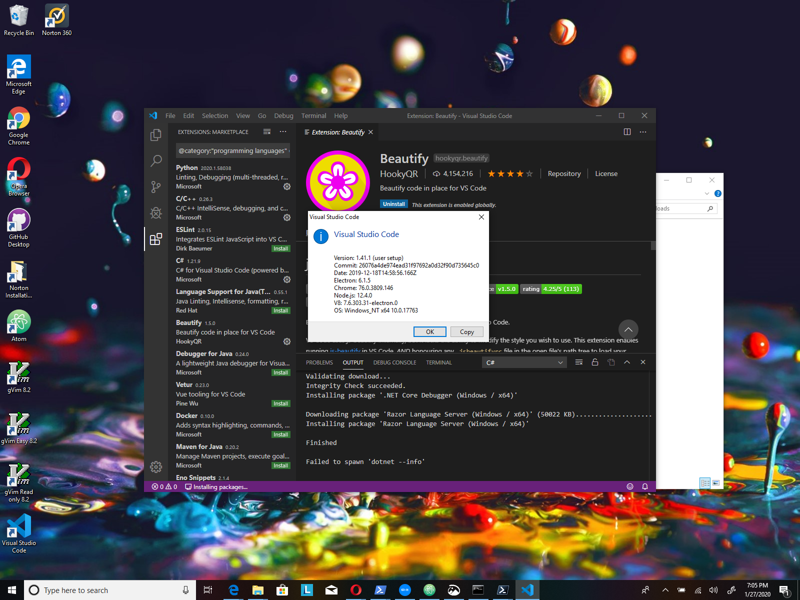

# Tooling Setup Assignment

In this assignment there will be a series of tools you need to install and complete small tutorials.  Copy this Markdown document and insert screenshots of the software installed.  Assignment worth 100 points 10 items, 10 points each.

## Sign Up for a GitHub.com Account

If you have not already signed up for a [GitHub.com](https://github.com "Github.com signup") account, do so.  We recommend using your name or some combination of your name, not your Hawk ID as this account is yours the rest of your life.  Once you have your ID, submit it on BlackBoard under Assignments > Tooling > GitHubID.  If you already have an ID, then just submit that ID.

Github ID is submitted. It is pramni

## Installation of PowerShell Core for Windows

If you have a Windows 10 system, make sure that the native SSH client and [PowerShell Core 6](https://github.com/PowerShell/PowerShell/releases/tag/v6.2.3 "PowerShell Core 6 Download") are installed.  Add screenshot of the output of: ```ssh -V``` and open the PowerShell 6 (darkblue screen) and the version is shown in the top line.   For Mac, you have Bash and SSH already installed, place a screenshot of the output of ```ssh -V``` and ```bash --version```



This link provides information on installing Bash 5.0 on MacOS and activating it to replace Bash 3.x
[https://www.ioannispoulakas.com/2019/03/10/how-to-install-bash-5-on-macos/](https://www.ioannispoulakas.com/2019/03/10/how-to-install-bash-5-on-macos/ "Replace bash 3 with 5 MacOS")

## Package Managers for Windows and MacOS

Brew is the MacOS 3rd party package manager located at: [https://brew.sh/](https://brew.sh/ "brew installer page").  [Chocolatey.org](https://chocolatey.org/ "Chocolatey.org download page") is the Windows 3rd party package manager.  Place screenshot of the version command output for: ```choco --version``` or ```brew --version```



## Install Git

Using the package manager from the previous step, install the Git Client if you do not already have it installed.  **Note**, this is different from the GitHub Desktop tool, which we will not be using this semester.
Place a screenshot of the output of the command: ```git --version```

You will need to configure Git if you already haven't done so.  From a shell run these two commands:

```bash

git config --global user.name "<Your Name>"
git config --global user.email "<youremail@example.com>"
```

## Install VirtualBox

If you do not already have VirtualBox 6.x installed, use the package manager to install VirtualBox.  Take a screenshot of the VirtualBox > Help > About VirtualBox output.  If you have 6.0.x at the moment, no need to upgrade.

In chocolatey you can pin the VirtualBox version with this syntax (it needs to be on a line by itself)
```choco install virtualbox --version 6.0.16```

Try to use 6.0.x until the two applications are compatible.  Here are the direct download links

* Windows 10 - [https://download.virtualbox.org/virtualbox/6.0.16/VirtualBox-6.0.16-135674-Win.exe]https://download.virtualbox.org/virtualbox/6.0.16/VirtualBox-6.0.16-135674-Win.exe "Direct win10 vbox download link"
* MacOS - [https://download.virtualbox.org/virtualbox/6.0.16/VirtualBox-6.0.16-135674-OSX.dmg](https://download.virtualbox.org/virtualbox/6.0.16/VirtualBox-6.0.16-135674-OSX.dmg "MacOS Vbox Download link")
* Linux Ubuntu - [https://download.virtualbox.org/virtualbox/6.0.16/virtualbox-6.0_6.0.16-135674~Ubuntu~bionic_amd64.deb](https://download.virtualbox.org/virtualbox/6.0.16/virtualbox-6.0_6.0.16-135674~Ubuntu~bionic_amd64.deb "Ubuntu Direct Download")

**Note** - there is some incompatibility with VirtualBox 6.1.x and Vagrant 2.2.6. There is currently a manual workaround at [https://blogs.oracle.com/scoter/getting-vagrant-226-working-with-virtualbox-61-ga](https://blogs.oracle.com/scoter/getting-vagrant-226-working-with-virtualbox-61-ga "VirtualBox manual Workaround").

Version 6.x works with Vagrant 2.2.



## Install Vagrant

Using a package manager, install the latest version of [Vagrant](https://vagrantup.com "Vagrant download site").  If you have a version 2.2.x you will be ok.  Note, if on Linux, do not use the built in package manager as these versions of Vagrant and Packer are too old and unmaintained.  Place a screenshot of the output of the command: ```vagrant --version```



Complete the Vagrant tutorial located at [https://www.vagrantup.com/intro/getting-started/index.html](https://www.vagrantup.com/intro/getting-started/index.html "Vagrant tutorial"), up to the TEARDOWN step, skipping the SHARE step.  

After completing this tutorial take a screenshot of the output of the command ```vagrant box list```

**Note** - there is some incompatibility with VirtualBox 6.1.x and Vagrant 2.2.6. There is currently a manual workaround at [https://blogs.oracle.com/scoter/getting-vagrant-226-working-with-virtualbox-61-ga](https://blogs.oracle.com/scoter/getting-vagrant-226-working-with-virtualbox-61-ga "VirtualBox manual Workaround").

Version 6.x works with Vagrant 2.2.


## Install Packer.io

Using a package manager, install the latest version of [Packer](https://packer.io "Packer install site").  If you have a version > 1.4.x you will be ok. Note, if on Linux, do not use the built in package manager as these versions of Vagrant and Packer are too old and unmaintained.  Place a screenshot of the output of the command: ```packer --version


I have a series of samples that I use from Packer to build images.  Clone this sample repo to your computer: ```git clone https://github.com/jhajek/packer-vagrant-build-scripts```  navigate to the ```packer/vanilla-install``` directory from the command line.  Issue the command: ```packer build ubuntu18043-vanilla.json```

Take a screenshot of the output of the ```build``` directory showing the ```*.box``` file.  In the ```build``` directory, create a directory named **ubuntu-vanilla**.  ~```cd``` into that directory and issue the ```vagrant init``` command:~



## Install IDE editor

After installing an IDE editor of your choice, pick one of the listed or you can use another one, but it needs to have native Git support built into the editor.  Take a screenshot of output of the help > about button in the application.  You can install all or any of these via the package managers Chocolatey and Brew.

* [VSCode from Microsoft](https://code.visualstudio.com/ "VSCode install")
  * Cross platform and has direct shell integration
  * 
* [atom.io](https://atom.io/ "Atom.io install")
  * Built by GitHub for Git integration
* [Sublime Text](http://www.sublimetext.com/ "Submlime Text installer site")
  * Built for a MacOS native experience, A sophisticated text editor for code, markup and prose.  Available for all platforms.
* [Adobe Brackets](http://brackets.io/ "Adobe Brackets Install")
  * Cross Platform development tool from Adobe


## Git-It Tutorial

Download, extract, and execute the Git-It tutorial, located: [https://github.com/jlord/git-it-electron/releases](https://github.com/jlord/git-it-electron/releases "Git-It release tutorial").  The program runs as an executable so there is no installation needed and is cross platform.  The program does require you to have completed and configured Git, which we did in a previous step.  

Post a screenshot of your completion badge (or dots) after you finish the tutorial.


## Create and Push your Readme.md

Final step, is to clone the Private GitHub repo you have been provided with by the professor (you received an invite email to it).  If you already have a private repo provided by the professor from a previous class, just create a new folder named **itmd-521**, no spaces! Ever! and push your new folder along with a Readme.md file and a folder named **images**.  

This Readme.md will contain these elements written in Markdown. This is a good [Markdown cheatsheet reference](https://github.com/adam-p/markdown-here/wiki/Markdown-Cheatsheet "Markdown cheatsheet").

The document will include:

* h1 Pv Ramni
  * 
* h2 Where are you from
  * From the Chicago suburbs of Naperville
* h2 IT Interests
  * Telecommunication Engineer, C Programming
* h2 Something Interesting About You
  * Play TableTennis, Jogging and Swimming
* h2 Git-It Badge
   * 

Push this to your GitHub private account repo.

Here is my own completed sample: [https://github.com/illinoistech-itm/jhajek/blob/master/itmd-521/Readme.md](https://github.com/illinoistech-itm/jhajek/blob/master/itmd-521/Readme.md "Professor's GitHub Repo Sample").  **Note**, I will have more folders then you because I have sample code for more classes.

## Final deliverable to Blackboard

Submit to Blackboard the URL to your GitHub private repo, so I can clone and see all these elements.  Make sure to push code as you go and push this edited Readme.md file under the tooling-assignments folder.
